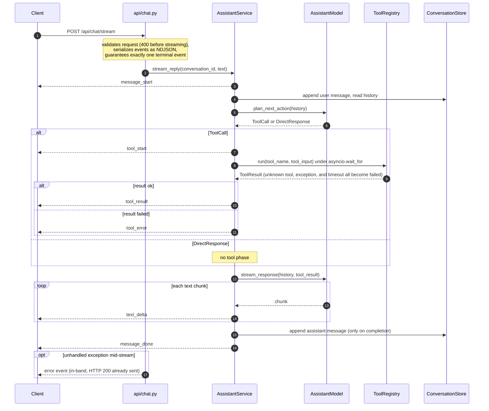
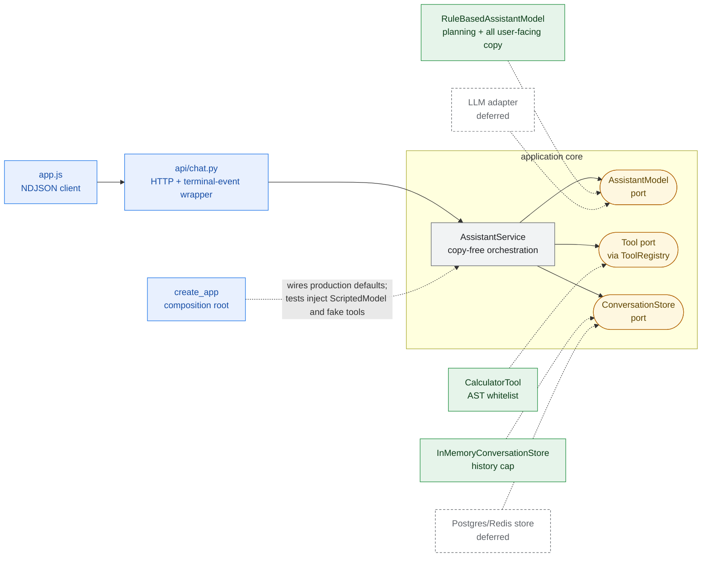
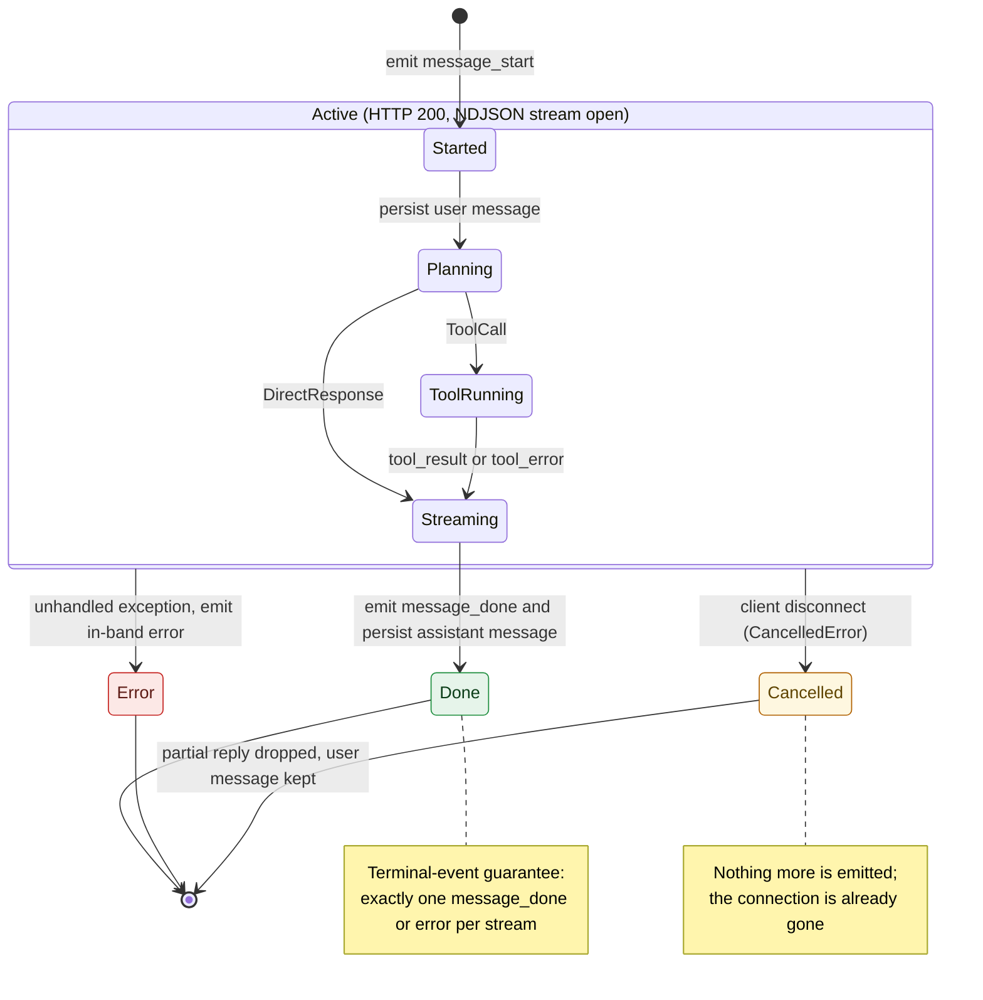

# Design

## Architecture

Dependency rule: `api -> AssistantService -> protocols`; adapters implement
the protocols.

- `AssistantService.stream_reply` is the orchestrator: emit `message_start`,
  persist the user message, ask the model to plan, maybe run one tool through
  the registry (with a timeout), then let the model stream the reply text and
  persist it on successful completion.
- `AssistantModel` (protocol): `plan_next_action` returns a `ToolCall` or a
  `DirectResponse`; `stream_response` is the single authority for user-facing
  text on both paths. The service contains no copy at all, which is what makes
  the model swappable and the product localizable (Spanish/Portuguese) without
  touching orchestration. The default implementation is deterministic: regex
  intent detection plus AST pre-validation, so a doomed expression never
  becomes a tool call.
- `Tool` (protocol) + `ToolRegistry`: dict lookup; an unknown tool name comes
  back as a failed result rather than an exception. The backend, not the
  model, is the authority on which tools exist.
- `ConversationStore` (protocol) + in-memory implementation with a history cap.
- `create_app(model, store, tools)` is the composition root: production
  defaults, fakes injected by tests.

The planner reuses the calculator's own validator, so planner and executor
agree by construction. A real LLM adapter slots in by implementing
`AssistantModel`; both protocol methods are async-shaped for exactly that.
Tests keep running against the deterministic default either way.

## Diagrams

Main runtime components:

- `POST /api/chat/stream` (app/api/chat.py, app/main.py): validates input, streams typed `StreamEvent`s as NDJSON, guarantees exactly one terminal event per stream.
- `AssistantService.stream_reply` (app/services/assistant.py): persists the user message, plans, runs at most one tool under a timeout, streams reply text, persists the assistant message on completion.
- `RuleBasedAssistantModel` (app/models/rule_based.py): plans via regex intent detection plus AST pre-validation and owns every user-facing string.
- `ToolRegistry` + `CalculatorTool` (app/services/tool_registry.py, app/tools/calculator.py): dict-lookup tool dispatch that fails closed on unknown names; arithmetic evaluated over a whitelisted AST.
- Static frontend (app/static/app.js): parses the NDJSON stream incrementally and renders the streaming bubble plus a live tool status pill.

### Reply orchestration

`stream_reply` over time: where events are emitted, where persistence happens, and how tool failures still end in a completed reply.

Source: app/api/chat.py, app/services/assistant.py, app/services/tool_registry.py.

### Ports and adapters

The hexagonal core: the service depends on three protocols only, adapters implement them, and `create_app` does the wiring. A real LLM or a durable store is an implementation of an existing seam, not a redesign; tests inject fakes at the same points.

Source: app/main.py, app/services/assistant.py, app/models/protocol.py, app/models/rule_based.py, app/services/tool_registry.py, app/services/conversation_store.py, app/tools/calculator.py, tests/test_assistant_service.py.

### Stream lifecycle

The state machine behind the two invariants: every stream ends in exactly one `message_done` or `error` event, and a disconnect drops the partial reply while keeping the user message.

Source: app/services/assistant.py, app/api/chat.py, tests/test_api_stream.py.

## Key tradeoffs

**Deterministic model over a real LLM.** The exercise is the architecture
around the model, not the model. A rule-based planner keeps every test offline
and reproducible; an LLM becomes an implementation of an existing seam, not a
redesign.

**NDJSON over POST instead of SSE or WebSockets.** One request per message is
the simplest contract that still demonstrates real streaming. SSE brings
reconnect and event-id semantics, WebSockets bring connection lifecycle
management; this exercise needs neither. The event vocabulary is
transport-neutral, so either could replace the transport without touching the
service.

**Terminal-event guarantee with in-band errors.** Once streaming starts, HTTP
200 is already on the wire, so failures cannot become status codes. Every
stream ends in exactly one `message_done` or `error` event; clients never see
a silently half-dead stream. Errors are logged with metadata only, never
message content.

**Disconnect policy.** A client disconnect raises `CancelledError` inside the
generator and is not swallowed: the user message is already persisted, the
assistant message persists only on successful completion. Partial replies are
dropped, never half-saved.

**In-memory store, capped.** A protocol boundary with a history cap keeps
memory bounded. Concurrent posts to the same conversation are a documented
limitation (interleaved history writes); a per-conversation asyncio lock is
the first fix if it starts to matter.

**Flat event model.** One `StreamEvent` with optional fields keeps the wire
format and the frontend switch simple. The natural evolution is a
discriminated union per event type once the vocabulary grows.

**Sync store protocol.** Reads and writes are in-process today. A durable
store flips the protocol methods to async; mechanical, but worth naming.

## The four scaling questions

**Spikes in expensive operations.** Keep expensive work out of the chat
request path. Enqueue a job, stream back an acknowledgement carrying a
`job_id`, keep the conversation responsive, and notify on completion. Per-user
rate limits and provider circuit breakers stop a spike from cascading, and
separate worker pools isolate expensive workloads from the cheap chat loop.

**Long-running tasks mid-conversation.** The same job pattern with durable
status, idempotency keys so retries are safe, bounded retries with backoff,
and explicit cancellation. The conversation references the job instead of
blocking on it, so the user keeps chatting while it runs.

**Storage at millions of users.** Postgres partitioned by conversation for
messages, Redis for hot session state, object storage for media. History
pagination plus summarization keeps context and queries bounded; retention
policies and PII separation are designed in from the start. Logs carry event
types and latencies, never message content, matching the confidentiality bar
of a consumer assistant.

**Cheaper vs more capable model.** Route by task type, risk, and latency
budget across `AssistantModel` implementations. Gate deploys on offline golden
evals (`tests/cases/basic.jsonl` is the seed of exactly that) and watch online
metrics: fallback rate, retry rate, cost per successful task. A cheaper model
is only cheaper if it does not increase retries and failures.

## Explicit deferrals

- Real LLM adapter (implements `AssistantModel`; tests stay deterministic)
- Multi-step tool loops (one plan per reply today)
- Additional tools beyond the calculator
- Postgres/Redis persistence behind `ConversationStore`
- Background jobs and queues
- Auth and rate limiting
- WebSocket/SSE transports
- Observability stack (metrics, tracing)
- Docker packaging
- Model routing

## With more time

A thin `run_evals.py` CLI over the same golden jsonl, a per-conversation write
lock, and a README GIF of the tool-error flow.
